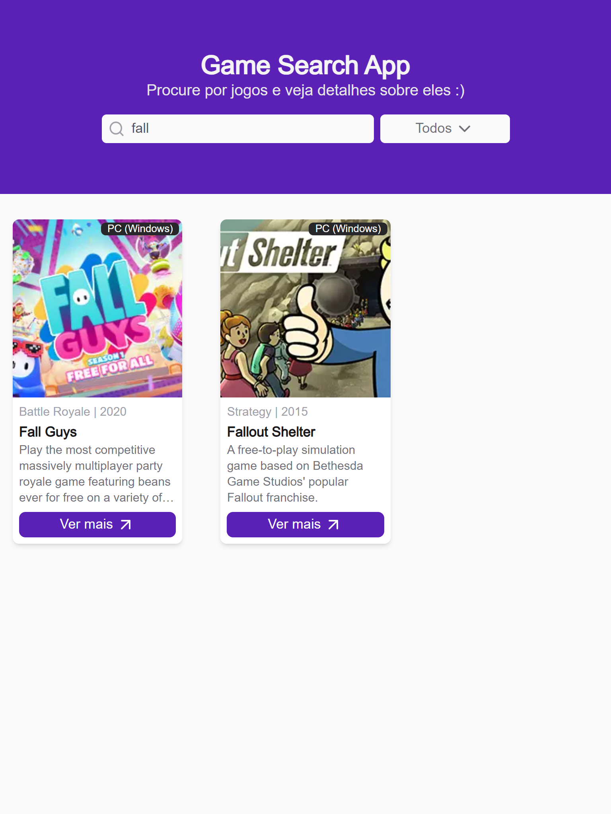
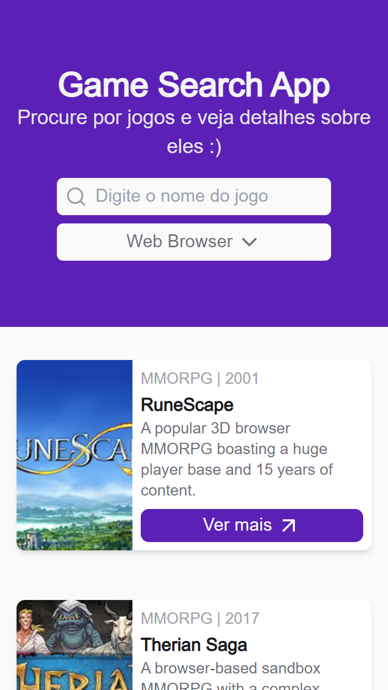
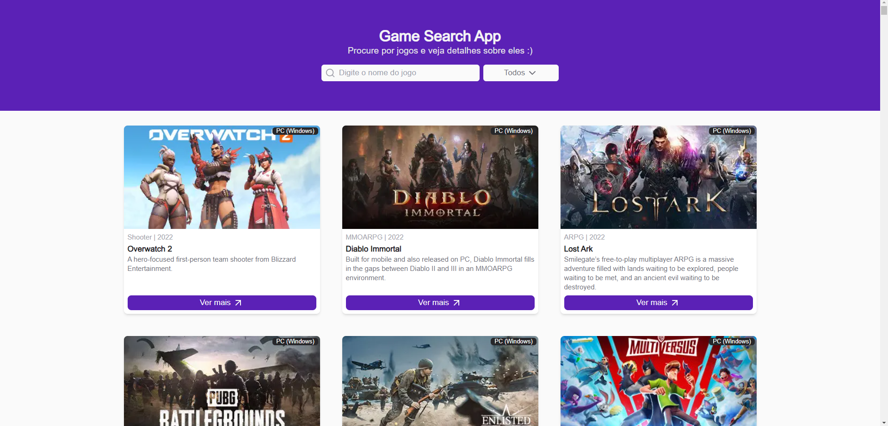
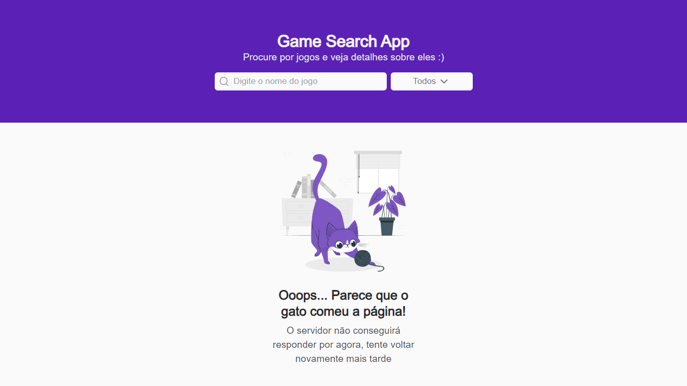
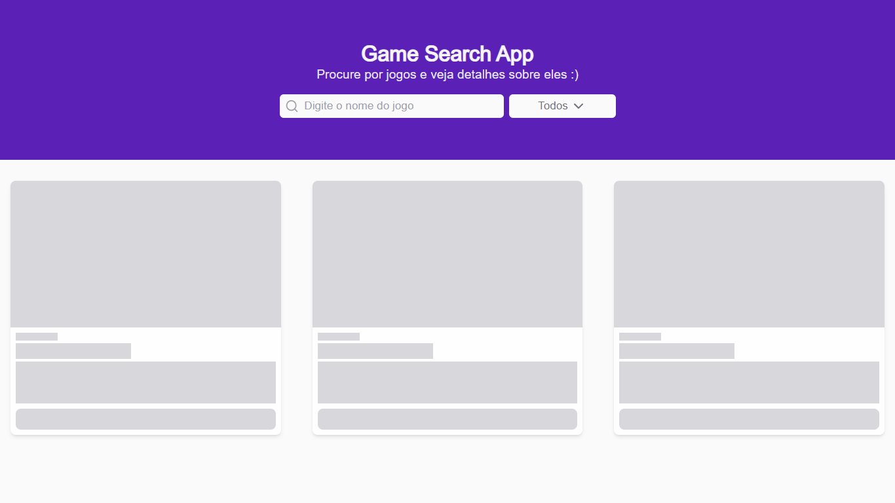

## Game Search App
Procure por jogos e veja detalhes sobre eles :)

## Como rodar o projeto
1. Clone o repositório
2. Instale as dependências com `yarn`
3. Inicie o app com `yarn dev`

## Tecnologias utilizadas
- ReactJS
- NextJS
- TypeScript
- TailwindCSS
- Axios

## Screenshots

